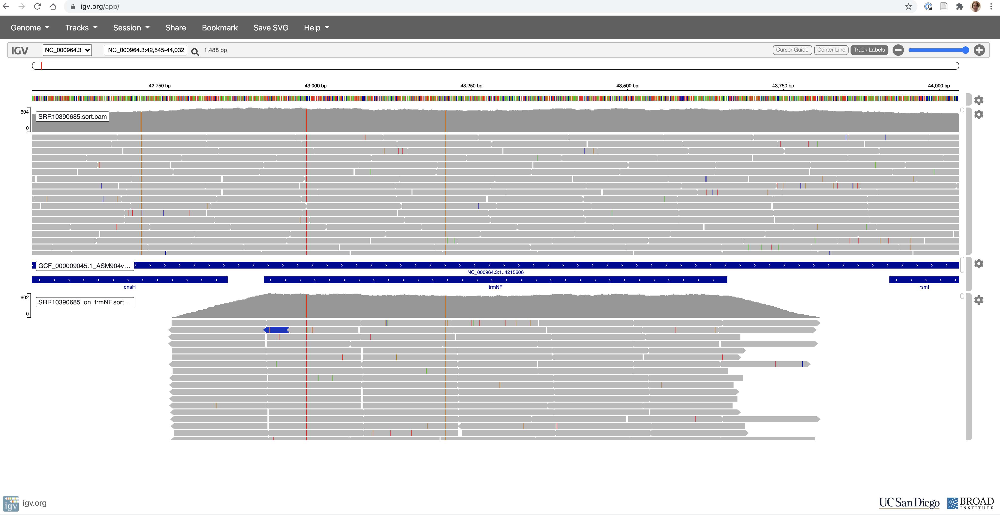

```{r setup, include=FALSE}
knitr::opts_chunk$set(eval=FALSE, echo =TRUE, cache = FALSE, message = FALSE, warning = FALSE, cache.lazy = FALSE,
                      fig.height = 3.5, fig.width = 10.5)
```

# Consignes {-}

Complétez ce document en remplissant les chunks vides pour écrire le code qui vous a permis de répondre à la question. Les réponses attendant un résultat chiffré ou une explication devront être insérés entre le balises html `code`. Par exemple pour répondre à la question suivante :

    La bioinfo c'est : <code>MERVEILLEUX</code>.
    
N'hésitez pas à commenter votre code, enrichier le rapport en y insérant des résultats ou des graphiques/images pour expliquer votre démarche. N'oubliez pas les **bonnes pratiques** pour une recherche **reproductible** !
Nous souhaitons à minima que l'analyse soit reproductible sur le cluster de l'IFB.

# Introduction {-}

Vous allez travailler sur des données de reséquençage d'un génome bactérien : _Bacillus subtilis_. Les données sont issues de cet article :

* [Complete Genome Sequences of 13 Bacillus subtilis Soil Isolates for Studying Secondary Metabolite Diversity](https://mra.asm.org/content/9/2/e01406-19)

# Analyses

## Organisation de votre espace de travail

```{bash}
# Je travaille dans mon répertoire de travail qui est associé au projet "dubii2021", sur le cluster de l'IFB.
cd /shared/projects/dubii2021/glelandais/modules-4-5-evaluation/.
# Création des différents répertoires qui seront utilisés pour organiser les fichiers.
mkdir raw-data
mkdir quality-controls
mkdir clean-data
mkdir mapping
```

## Téléchargement des données brutes

Récupérez les fichiers FASTQ issus du run **SRR10390685** grâce à l'outil <strong class="tool">sra-tools</strong> @sratoolkit

```{bash}
# Travail dans le répertoire dédié au stockage des données initiales.
cd raw-data
# Comme je vais utiliser les outils en dehors d'un script (copier/coller),
# il me semble que cette commande est importante, afin de réserver des ressurces sur le cluster.
salloc --cpus-per-task=10 --mem=1G
# Chargement du module 
module load sra-tools
# Lancement du téléchargement des fichiers FASTQ
srun fasterq-dump -p --split-files SRR10390685
# --> Deux fichiers FASTQ ont été obtenus.
```

Combien de reads sont présents dans les fichiers R1 et R2 ?

```{bash}
# Chaque read est composé de 4 lignes dans un fichier FASTQ. La première débute
# par le symbole @. Je compte donc ces lignes dans les fichiers FASTQ et j'obtiens le
# nombre de reads. A noter que la même valeur est attendue pour les deux fichiers (données paired-end).
grep -c "^@" SRR10390685_1.fastq
grep -c "^@" SRR10390685_2.fastq
```

Les fichiers FASTQ contiennent <code>7066055</code> reads.

Téléchargez le génome de référence de la souche ASM904v1 de _Bacillus subtilis_ disponible à [cette adresse](https://ftp.ncbi.nlm.nih.gov/genomes/all/GCF/000/009/045/GCF_000009045.1_ASM904v1/GCF_000009045.1_ASM904v1_genomic.fna.gz)

```{bash}
# Utilisation de la commande wget.
wget https://ftp.ncbi.nlm.nih.gov/genomes/all/GCF/000/009/045/GCF_000009045.1_ASM904v1/GCF_000009045.1_ASM904v1_genomic.fna.gz
```

Quelle est la taille de ce génome ?

```{bash}
# Pour simplifier les prochaines commandes, je décide de décompresser le fichier génome.
# A noter que étape n'est pas indispensable (ni même conseillée si l'on a le souci de préserver la quantité d'espace disque disponible).
gunzip GCF_000009045.1_ASM904v1_genomic.fna.gz

# Décompte du nombre de bases dans le fichier (attention de ne pas compter les caractères de fin de ligne !).
cat GCF_000009045.1_ASM904v1_genomic.fna | grep -v "NC_" | tr --delete "\n" | wc -c
# Note : J'ai trouvé de l'aide ici :
# https://dridk.me/genome_chiffre_1.html
```

La taille de ce génome est de <code>4215606</code> paires de bases.

Téléchargez l'annotation de la souche ASM904v1 de _Bacillus subtilis_ disponible à [cette adresse](https://ftp.ncbi.nlm.nih.gov/genomes/all/GCF/000/009/045/GCF_000009045.1_ASM904v1/GCF_000009045.1_ASM904v1_genomic.gff.gz)

```{bash}
# Utilisation de la commande wget.
wget https://ftp.ncbi.nlm.nih.gov/genomes/all/GCF/000/009/045/GCF_000009045.1_ASM904v1/GCF_000009045.1_ASM904v1_genomic.gff.gz
# A nouveau, je fais le choix de décompression le fichier (étape non indispensable).
gunzip GCF_000009045.1_ASM904v1_genomic.gff.gz
```

Combien de gènes sont connus pour ce génome ?

```{bash}
# J'écris une commande Bash qui permet d'extraire la troisième colonne du fichier et
# de compter des occurences du mot "gene".
cut -f 3 GCF_000009045.1_ASM904v1_genomic.gff | grep -c gene
```

<code>4536</code> gènes sont recensés dans le fichier d'annotation.

## Contrôle qualité

Lancez l'outil <strong class="tool">fastqc</strong> @fastqc dédié à l'analyse de la qualité des bases issues d'un séquençage haut-débit

```{bash}
# Changement de répertoire de travail.
cd ../quality-controls
# Chargement du module
module load fastqc
# Lancement des analyses qualités. Les fichiers de résultats sont écris dans le répertoire
# de travail.
srun fastqc ../raw-data/SRR10390685_1.fastq -o .
srun fastqc ../raw-data/SRR10390685_2.fastq -o .
# Création d'un rapport MultiQC
module load multiqc
srun multiqc -d . -o .
```

La qualité des bases vous paraît-elle satisfaisante ? Pourquoi ?

- [x] Oui
- [ ] Non

car <code>les valeurs de score qualité sont élevées (> Q30)</code> comme le montre <code>le graphique "Per base sequence quality". Les autres graphiques ne révèlent pas de problème particulier ici. Ce jeu de données est bien.</code>

Lien vers le [rapport MulitQC](https://gaellelelandais.github.io/DUBii2021/multiqc_report.html)

Est-ce que les reads déposés ont subi une étape de nettoyage avant d'être déposés ? Pourquoi ?

- [x] Oui
- [ ] Non

car <code>tous les reads n'ont pas la même longueur. Un filtrage des séquences des adaptateurs a certainement été réalisé</code>.

Quelle est la profondeur de séquençage (calculée par rapport à la taille du génome de référence) ?

```{bash}
# Je ne vais pas de solution pour répondre à cette question autrement qu'en réalisant
# le calcul moi même. Utilisation donc de la formule du cours :
# N*L/G ; avec N = Nombre de lectures, L = Longueur des lectures et G = Taille du génome 
# ((7066055 * 2) * 151) / 4215606 = 506.2021  
```

La profondeur de séquençage est de : <code>500</code> X.

## Nettoyage des reads

Vous voulez maintenant nettoyer un peu vos lectures. Choisissez les paramètres de <strong class="tool">fastp</strong> @fastp qui vous semblent adéquats et justifiez-les.

```{bash}
# Changement du répertoire de travail
cd ../clean-data
# Chargement du logiciel
module load fastp
# Allocation de ressources sur le cluster (j'ai augmenté ici la taille de la mépoire, car
# 1G n'était pas suffisant lors de mon premier essai).
salloc --cpus-per-task=10 --mem=5G
# Lancement de fastp. J'utilise par simplicité les mêmes paramètres que ceux utilisés lors du TP.
# La qualité des fichiers FASTQ est cohérente avec celle que nous avions pour les fichiers
# utilisés lors du TP.
srun fastp --in1 ../raw-data/SRR10390685_1.fastq --in2 ../raw-data/SRR10390685_2.fastq --out1 ./SRR10390685_1_clean.fastq --out2 ./SRR10390685_2_clean.fastq --html ./fastp.html --cut_mean_quality 30 --cut_window_size 8 --length_required 100 --cut_tail --json ./fastp.json
```

Les paramètres suivants ont été choisis : 


|Parametre | Valeur | Explication |
|----------|--------|-------------|
| cut_mean_quality |30  |Valeur utilisée lors de la séance de TP  |
| cut_window_size |8  |Valeur utilisée lors de la séance de TP  |
| length_required |100  |Valeur utilisée lors de la séance de TP  |
| cut_tail |  |Utilisée lors de la séance de TP |

Ces paramètres ont permis de conserver <code>6777048</code> reads pairés, soit une perte de <code>4.1</code>% des reads bruts.

## Alignement des reads sur le génome de référence

Maintenant, vous allez aligner ces reads nettoyés sur le génome de référence à l'aide de <strong class="tool">bwa</strong> @bwa et <strong class="tool">samtools</strong> @samtools.

```{bash}
# Changement de répertoire de travail
cd ../mapping/
# Chargement du programme
module load bwa
# Première étape de création des index
srun bwa index ../raw-data/GCF_000009045.1_ASM904v1_genomic.fna
# Deuxième étape des alignements des reads sur le génome
srun bwa mem ../raw-data/GCF_000009045.1_ASM904v1_genomic.fna ../clean-data/SRR10390685_1_clean.fastq ../clean-data/SRR10390685_2_clean.fastq > SRR10390685.sam
# Troisième étape de conversion des fichiers.
# Utilisation de samtools
module load samtools
# Succession d'étapes classiques (conversion en fichier binaire, tri et indexage).
srun samtools view SRR10390685.sam -b > SRR10390685.bam
srun samtools sort SRR10390685.bam -o SRR10390685.sort.bam
srun samtools index SRR10390685.sort.bam
# Pour terminer suppression des fichiers inutiles.
rm -f SRR10390685.sam SRR10390685.bam
```

Combien de reads ne sont pas mappés ?

```{bash}
# Statistiques en relation avec les résultats de l'alignement.
srun samtools idxstats SRR10390685.sort.bam > SRR10390685.sort.bam.idxstats
srun samtools flagstat SRR10390685.sort.bam > SRR10390685.sort.bam.flagstat
```

<code>40266</code> reads ne sont pas mappés.

## Croisement de données

Calculez le nombre de reads qui chevauchent avec au moins 50% de leur longueur le gène _trmNF_ grâce à l'outil <strong class="tool">bedtools</strong> @bedtools:

```{bash}
# Recherche des informations qui concernent le gène d'intérêt, création d'un nouveau fichier GFF
grep trmNF ../raw-data/GCF_000009045.1_ASM904v1_genomic.gff | awk '$3=="gene"' > trmNF_gene.gff3

# Chargement de la suite de programmes
module load bedtools

# Allocation de ressources sur le cluster
salloc --cpus-per-task=10 --mem=1G

# Sélection des reads alignés sur le gène d'intérêt.
# Il faudrait ajouter ici l'option -f pour indiquer que seuls les reads qui ont un chevauchement
# sur une longueur de 50% sont conservés.
srun bedtools intersect -a SRR10390685.sort.bam -b trmNF_gene.gff3 -sorted > SRR10390685_on_trmNF.bam

# Tri et indexage des reads
srun samtools sort SRR10390685_on_trmNF.bam -o SRR10390685_on_trmNF.sort.bam
srun samtools index SRR10390685_on_trmNF.sort.bam
# Nombre de reads présent dans le fichier résultat
srun samtools idxstats SRR10390685_on_trmNF.sort.bam > SRR10390685_on_trmNF.sort.bam.idxstats
```

<code>3394</code> reads chevauchent le gène d'intérêt.


## Visualisation

Utilisez <strong class="tool">IGV</strong> @igv sous [sa version en ligne](https://igv.org/app/) pour visualiser les alignements sur le gène. Faites une capture d'écran du gène entier.



# References